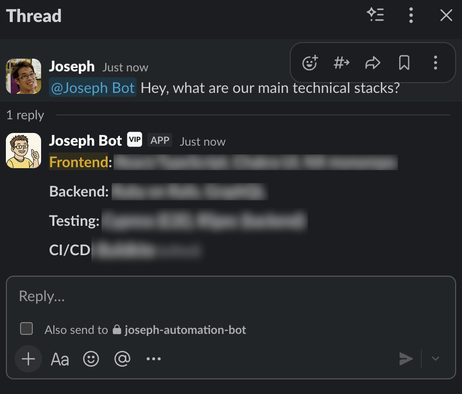
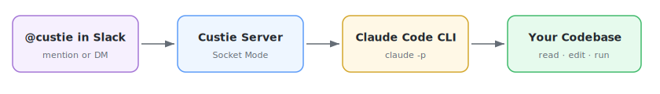

# Custie

**Claude Code, inside your Slack.** Your team gets an AI that can read your codebase, edit files, run commands, and use every Claude Code skill -- all from a Slack thread.

<p align="center">
  
</p>


## Why Custie?

Claude Code is powerful, but it lives in your terminal. Custie brings the **full Claude Code experience** into Slack:

- **Ask about your codebase** -- `@custie what does the auth middleware do?`
- **Make changes** -- `@custie add input validation to the signup endpoint`
- **Run commands** -- `@custie run the test suite and fix any failures`
- **Use skills & MCP servers** -- everything Claude Code can do, your bot can do

Sessions persist across messages. Start a conversation in a thread, come back hours later, and pick up right where you left off.

<p align="center">
  
</p>

## How It Works

Custie runs on your machine (or server) and connects to Slack via **Socket Mode** -- no webhooks, no tunnels, no public URLs. When someone mentions the bot, it spawns a real Claude Code process with full access to your project.

<p align="center">
  
</p>

## Get Started

First, install [Claude Code](https://docs.anthropic.com/en/docs/claude-code) if you haven't already:

```bash
npm install -g @anthropic-ai/claude-code
```

Then install and run Custie:

```bash
npm install -g custie
custie setup                                # configure Slack app + tokens
custie start                                # run the bot
```

That's it. Go to Slack and `@custie hello`.

> **Want it always running?** Run `custie install` to set up a background service (launchd on macOS, systemd on Linux).

## Update

```bash
custie upgrade
```

## Uninstall

If you installed Custie as a background service, remove it first:

```bash
custie uninstall
```

Then remove the package:

```bash
npm uninstall -g custie
```

To also remove config and data:

```bash
rm -rf ~/.config/custie ~/.local/share/custie
```

## Customise Your Bot

**System prompt** -- Define your bot's personality and behaviour:

```bash
custie prompt    # opens ~/.config/custie/prompt.md in your editor
```

**Access control** -- By default, only the owner can use the bot (it runs with full filesystem access). Add trusted user IDs to open it up:

```bash
custie config --edit
```

## CLI Reference

| Command | What it does |
|---|---|
| `custie setup` | Guided setup (paste tokens yourself) |
| `custie setup --browser` | Automated setup via Playwright (requires playwright) |
| `custie start` | Run the bot (foreground) |
| `custie install` | Install as background service |
| `custie uninstall` | Remove background service |
| `custie prompt` | Edit system prompt |
| `custie config` | Show current config |
| `custie config --edit` | Edit config file |
| `custie upgrade` | Upgrade to latest version |
| `custie --version` | Show version number |

## Configuration

All config lives in `~/.config/custie/`:

| File | Purpose |
|---|---|
| `config.env` | Slack tokens, working directory, access control |
| `prompt.md` | System prompt (bot personality & instructions) |

| Variable | Required | Description |
|---|---|---|
| `SLACK_BOT_TOKEN` | Yes | Bot User OAuth Token (`xoxb-...`) |
| `SLACK_APP_TOKEN` | Yes | App-Level Token (`xapp-...`) |
| `SLACK_SIGNING_SECRET` | Yes | From Slack app Basic Information |
| `CLAUDE_CWD` | No | Working directory for Claude |
| `BOT_NAME` | No | Display name (default: Custie) |
| `OWNER_USER_ID` | No | Your Slack user ID |
| `ALLOWED_USER_IDS` | No | Who can use the bot (defaults to owner) |

## Development

```bash
git clone <repo-url> && cd custie
pnpm install
pnpm run dev       # hot-reload
pnpm run build     # compile
pnpm run lint      # oxlint
```

## Architecture


## Licence

MIT
