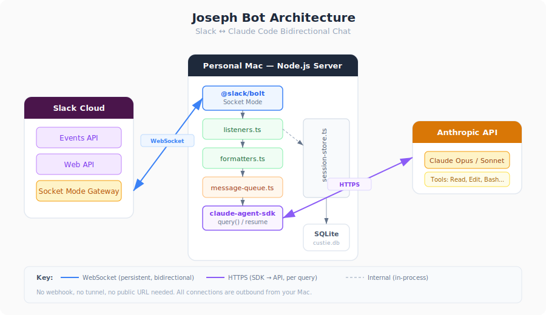

# Custie

A bidirectional chat server that bridges **Slack** and **Claude Code** via the Claude CLI. Mention the bot in a channel or DM it directly to start an AI-powered conversation that persists across messages.



## Features

- **Channel mentions** -- `@custie` in any channel starts a threaded conversation
- **Direct messages** -- DM the bot for private sessions
- **Persistent sessions** -- conversations resume automatically using SQLite-backed storage
- **Markdown conversion** -- translates Markdown to Slack's mrkdwn format
- **Message splitting** -- long responses are split at natural boundaries to respect Slack's limits
- **Per-thread queue** -- messages within a thread are processed serially to prevent race conditions
- **Access control** -- optionally restrict usage to specific Slack user IDs

## Prerequisites

- Node.js 18+
- A Slack workspace with a configured Slack app (see [Setup](#setup))
- Claude Code CLI installed (`npm install -g @anthropic-ai/claude-code`)

## Setup

Run the interactive setup script:

```bash
npm run setup
```

This will:

1. Check your Node.js version
2. Install dependencies
3. Build the project
4. Walk you through configuring Slack tokens
5. Optionally install Custie as an OS service (macOS LaunchAgent, Linux systemd, Windows scheduled task)

### Slack App Configuration

Your Slack app needs:

- **Socket Mode** enabled with an App-Level Token (`xapp-...`) that has the `connections:write` scope
- **Bot Token** (`xoxb-...`) with these scopes: `app_mentions:read`, `chat:write`, `im:history`, `im:read`, `im:write`, `channels:history`
- **Event Subscriptions** for `app_mention` and `message.im`

### Environment Variables

Copy `.env.example` to `.env` and fill in the values:

```bash
cp .env.example .env
```

| Variable | Required | Description |
|---|---|---|
| `SLACK_BOT_TOKEN` | Yes | Bot User OAuth Token (`xoxb-...`) |
| `SLACK_APP_TOKEN` | Yes | App-Level Token with `connections:write` (`xapp-...`) |
| `SLACK_SIGNING_SECRET` | Yes | Found in your Slack app's Basic Information page |
| `CLAUDE_CWD` | No | Working directory for Claude sessions (defaults to project root) |
| `ALLOWED_USER_IDS` | No | Comma-separated Slack user IDs; empty means everyone can use the bot |

## Usage

### Development

```bash
npm run dev
```

Starts the server with hot-reload via `tsx watch`.

### Production

```bash
npm run build
npm start
```

### Interacting with the Bot

- **In a channel:** mention `@custie` with your question. Follow-up messages in the thread continue the conversation (no need to re-mention).
- **In a DM:** just send a message. Every message continues the session for that DM (or thread within the DM).

## Scripts

| Command | Description |
|---|---|
| `npm run dev` | Start with hot-reload |
| `npm run build` | Compile TypeScript to `dist/` |
| `npm start` | Run the compiled server |
| `npm run lint` | Lint with oxlint |
| `npm run format` | Format with Prettier |
| `npm run format:check` | Check formatting |
| `npm run setup` | Interactive first-time setup |

## Project Structure

```
src/
  index.ts                 # Entry point, app initialisation, graceful shutdown
  config.ts                # Environment variable loader
  slack/
    app.ts                 # Slack Bolt app factory (Socket Mode)
    listeners.ts           # Event handlers for mentions, DMs, and threads
    formatters.ts          # Markdown-to-Slack conversion and message splitting
  claude/
    agent.ts               # Claude CLI subprocess integration and session management
  queue/
    message-queue.ts       # Per-thread serial message processing
  store/
    session-store.ts       # SQLite session persistence (WAL mode)
scripts/
  setup.mjs                # Interactive setup and OS service installer
```

## Tech Stack

- **TypeScript** with strict mode, ES2022 target
- **@slack/bolt** -- Slack app framework (Socket Mode)
- **Claude CLI** -- Claude Code integration (spawned as subprocess)
- **better-sqlite3** -- session storage with WAL journaling
- **tsup** -- bundler for ESM output
- **oxlint** + **Prettier** -- linting and formatting

## Licence

Private -- all rights reserved.
